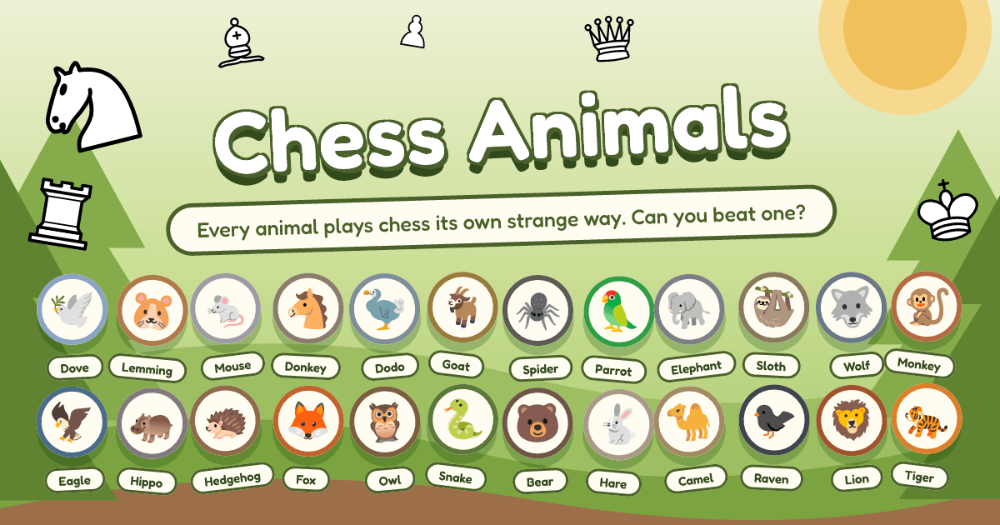

# chess-animals



Every animal plays chess its own strange way. Can you beat one?

Every animal — the random 🐴 Donkey, the greedy 🐒 Monkey — runs the same code. A personality is
nothing but a set of tunable heuristic weights, and a move is a dot product between those weights
and one feature vector describing the position.

Live at [dragunovartem99.github.io/chess-animals](https://dragunovartem99.github.io/chess-animals/),
in English and Russian.

The design comes from Tom 7's [_Elo World_](paper.pdf) (SIGBOVIK 2019), which rates a crowd of
deliberately weak or quirky players against each other to stretch the chess rating scale all the
way down — see [METHOD.md](./METHOD.md).

## Development

Requires Node.js ≥ 24.

```sh
npm install
npm run dev
```

| Command                             | What it does                                                       |
| ----------------------------------- | ------------------------------------------------------------------ |
| `npm run dev` / `build` / `preview` | Vite dev server / type-checked production build / preview of it    |
| `npm test` / `test:coverage`        | Vitest unit tests / with v8 coverage against a 90% threshold       |
| `npm run bench`                     | feature-extraction and search cost, held under guards by the suite |
| `npm run arena`                     | dev CLI: rate the roster over the paired opening set               |
| `npm run tune -- <botId>`           | dev CLI: SPSA-tune one bot's weights against the roster            |
| `npm run lint` / `format`           | oxlint / oxfmt (`:check` variants don't write)                     |
| `npm run types:check`               | `vue-tsc` type-check                                               |

Linting and formatting via [oxlint](https://oxc.rs)/[oxfmt](https://oxc.rs), type-checking via
`vue-tsc`, tests via Vitest. CI runs all of them plus the build on every push and pull request;
`main` deploys to GitHub Pages through the shared
[pipes](https://github.com/dragunovartem99/pipes) workflow.

## Documentation

| File                                 | Covers                                                                   |
| ------------------------------------ | ------------------------------------------------------------------------ |
| [ARCHITECTURE.md](./ARCHITECTURE.md) | how the app is built — layout, modules, the eval, the engine, deployment |
| [METHOD.md](./METHOD.md)             | what it measures — the paper, the feature vector, rating, tuning         |
| [CLAUDE.md](./CLAUDE.md)             | code conventions this repo holds itself to                               |
| [PLAN.md](./PLAN.md)                 | the commit ladder — what has landed and what lands next                  |

## Where it stands

Built: the feature evaluation, negamax search with quiescence, the UCI codec and worker client,
the board, `/play` with a per-feature breakdown of what the bot sees, `/frankenstein` as a live
weight-and-depth sandbox, and the dev CLIs — `npm run arena` (paired openings, Bradley-Terry
ratings with confidence intervals, a worker pool running whole games, adaptive pairing) and
`npm run tune` (SPSA against a gauntlet). The roster is listed weakest first, in the order the
arena rated them.

Next, per [PLAN.md](./PLAN.md): golden-game fixtures, the about page, and a tablebase probe
interface.

## Credit

[_Elo World, a framework for benchmarking weak chess engines_](paper.pdf), Dr. Tom Murphy VII
Ph.D., SIGBOVIK 2019. Board by [chessground](https://github.com/lichess-org/chessground), rules by
[chessops](https://github.com/niklasf/chessops), both from lichess.
