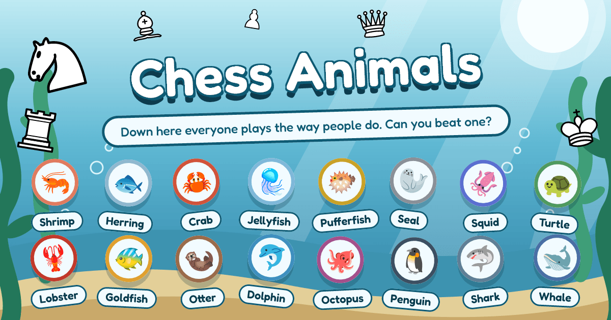
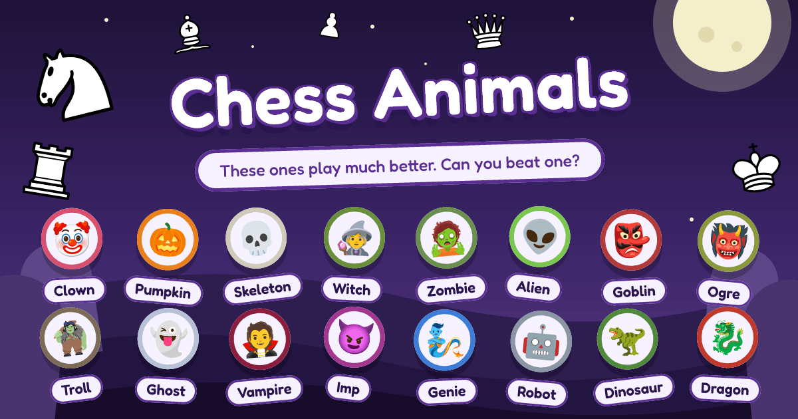

# chess-animals





Every animal plays chess its own strange way. Can you beat one?

Every animal — the random 🐴 Donkey, the check-happy 🐐 Goat — runs the same code. A personality is
nothing but a set of tunable heuristic weights, and a move is a dot product between those weights
and one feature vector describing the position.

Live at [chess-animals.com](https://chess-animals.com/),
in English and Russian.

The design comes from Tom 7's [_Elo World_](paper.pdf) (SIGBOVIK 2019), which rates a crowd of
deliberately weak or quirky players against each other to stretch the chess rating scale all the
way down — see [METHOD.md](./METHOD.md).

## Development

Requires Node.js ≥ 24, and clang 22 with lld, clang-tidy, clang-format and llvm for the C
engine under `engine/`.

```sh
npm install
npm run dev
```

| Command                             | What it does                                                            |
| ----------------------------------- | ----------------------------------------------------------------------- |
| `npm run dev` / `build` / `preview` | Vite dev server / type-checked production build / preview of it         |
| `npm test` / `test:coverage`        | C tests under ASan + UBSan, then Vitest / both with 90% coverage        |
| `npm run bench`                     | search cost through wasm, held under a guard by the suite               |
| `npm run engine:bench`              | the C engine natively: perft, each feature's cost, the search signature |
| `npm run arena`                     | dev CLI: rate the roster over the paired opening set                    |
| `npm run tune -- <botId>`           | dev CLI: SPSA-tune one bot's weights against the roster                 |
| `npm run lint` / `format`           | oxlint + clang-tidy / oxfmt + clang-format (`:check` don't write)       |
| `npm run types:check`               | `vue-tsc` type-check                                                    |
| `npm run engine:corpus`             | regenerate the C engine's chessops fixture corpus                       |

Linting and formatting via [oxlint](https://oxc.rs)/[oxfmt](https://oxc.rs), type-checking via
`vue-tsc`, tests via Vitest. CI runs all of them plus the build on every pull request;
`main` runs them again and, once green, deploys to [chess-animals.com](https://chess-animals.com/).

## Documentation

| File                                 | Covers                                                                   |
| ------------------------------------ | ------------------------------------------------------------------------ |
| [ARCHITECTURE.md](./ARCHITECTURE.md) | how the app is built — layout, modules, the eval, the engine, deployment |
| [METHOD.md](./METHOD.md)             | what it measures — the paper, the feature vector, rating, tuning         |
| [LAB.md](./LAB.md)                   | what each candidate feature measured against bare material               |
| [CLAUDE.md](./CLAUDE.md)             | code conventions this repo holds itself to                               |
| [PLAN.md](./PLAN.md)                 | what lands next                                                          |

## Where it stands

Three rosters of sixteen — land animals on the C engine, underwater animals on Maia, monsters on
Stockfish — rated together by the arena, in points pinned to Maia's human-like ratings, from the
Dove (−550) to the Dragon (2480), each listed weakest first. Built: the feature evaluation and a PVS search with quiescence in C compiled to wasm, the UCI codec and worker
client, `/play` with a per-feature breakdown of what the bot sees, `/about`, and the dev CLIs `npm run arena` and `npm run tune`.

Next, per [PLAN.md](./PLAN.md): golden-game fixtures and a tablebase probe interface.

## Credit

[_Elo World, a framework for benchmarking weak chess engines_](paper.pdf), Dr. Tom Murphy VII
Ph.D., SIGBOVIK 2019. Board by [chessground](https://github.com/lichess-org/chessground), rules by
[chessops](https://github.com/niklasf/chessops), both from lichess.
